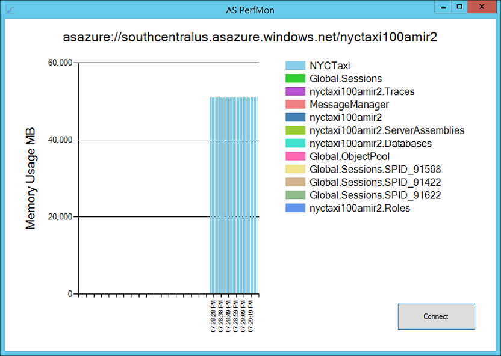

Monitor Analysis Services memory usage broken out by database and other high-level allocations in a stacked bar that increments at set interval. Useful during processing especially with multiple databases on same server.

